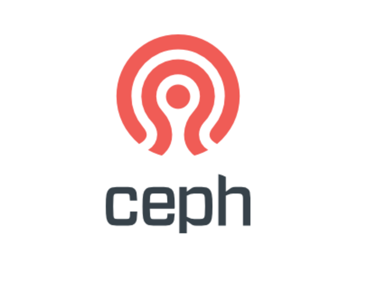
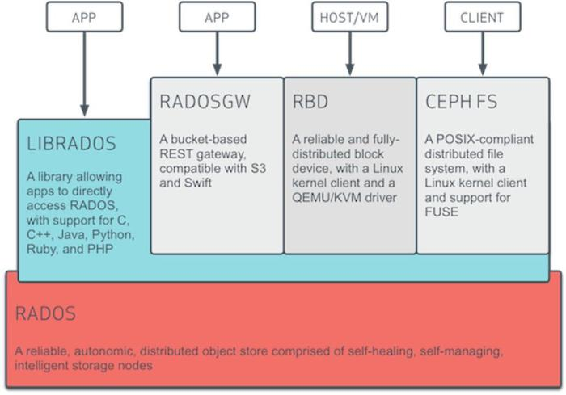

有人问我，你是如何做到统一存储的？我微微一笑，大声告诉他：Ceph在手，天下我有。

Ceph是一个统一的分布式存储系统，旨在实现出色的性能，可靠性和可扩展性。认了OpenStack做大哥之后更是一发不可收拾，受到大家广泛的关注。当然这都是因为他能提供多样可靠稳定的存储服务。

Ceph支持三种调用模式，这三种方式可以一同进行使用：

1. 对象存储（Object）：有原生的API，而且也兼容Swift和S3的API 2. 块存储（Block）：支持精简配置、快照、克隆
3. 文件系统挂载（File）：Posix接口，支持快照

是不是心间突生豪气，Ceph在手，当存尽天下所有AVI？

还记得上篇我们划重点的四个问题吗？在Ceph中是怎样去实现以实现可扩展、高性能、可靠性的呢？

1. 原始存储格式 or 特殊存储格式，通过什么格式存储才能方便的管理数据，保证数据的迁移和安全。

2. 大文件 or 小文件，文件系统适合大文件还是小文件存储，如何提供I/O效率。

3. 数据高可用 or 空间利用率，通过复制副本技术提高数据可用性必然会降低空间利用率，应该如何取舍。

4. 是否有元数据服务，元数据服务是保存存储数据元数据信息的服务，读写数据都需要连接元数据服务器保证一致性。存在元数据服务势必会存在单点问题和性能瓶颈问题。

我们先来看一下Ceph的基础架构图：

RADOS：位于Ceph的最下层，Reliable, Autonomic, Distributed Object Store，即可靠的、自动化的、分布式的对象存储。Ceph所有的存储功能都是基于RADOS实现,在RADOS中一个Object的大小（通常为2MB或4MB），以便实现底层存储的组织管理。所以Ceph底层也是将文件分割成多个小文件的方式进行存储的。

librados：顾名思义，这一层的功能是对RADOS进行抽象和封装，并向上层提供API，以便直接基于RADOS（而不是整个Ceph）进行应用开发。目前提供PHP、Ruby、Java、Python、C和C++支持，通用性很重要。

RADOS GW（RADOS Gateway）：提供与Amazon S3和Swift兼容的RESTful API的gateway，以供相应的对象存储应用开发使用。RADOS GW提供的API抽象层次更高，但功能则不如librados强大。

RBD（Reliable Block Device）：提供了一个标准的块设备接口，常用于在虚拟化的场景下为虚拟机创建volume

Ceph FS：是一个POSIX兼容的分布式文件系统

上层这三个模块都位于Ceph的应用接口层，其作用是在librados库的基础上提供抽象层次更高、更便于应用或客户端使用的上层接口。

通过上面对Ceph架构的简单介绍我们可以知道Ceph也是以特殊存储格式进行存储的，将文件切分成2M～4M的Object存储到RADOS中，对于小文件和大文件都支持。

Ceph有两个很重要的守护进程：OSDs and Monitors。

OSD（Object Storage Device）：负责响应客户端请求返回具体数据的进程。一个Ceph集群一般都有很多个OSD，支持自动备份和恢复。

Monitor：一个Ceph集群需要多个Monitor组成的小集群，它们通过Paxos协议（Zookeeper也是通过Paxos实现一致性）同步数据，用来保存OSD的元数据。

由此可见Ceph也需要元数据服务，但是实现了去中心化（划重点，需要理解OSD和Monitor的功能，如果对HBase了解的话，我觉得可以类比一下Zookeeper和HRegionServer的关系）。

## Ceph特性

CRUSH(Controlled Replication Under Scalable Hashing)算法，实现去中心化，没有单点故障（下篇会讲到）

统一的存储架构，提供不同的存储解决方案

支持副本和EC两种数据冗余方式

自我管理，自我修复

专为云基础架构和新兴工作负载而设计

横向扩展、动态伸缩、冗余容灾、负载平衡等

少年，Ceph了解一下？

参考：
[Ceph官方文档](http://docs.ceph.org.cn/architecture/)

欢迎关注我：叁金大数据（不稳定持续更新~~~）
