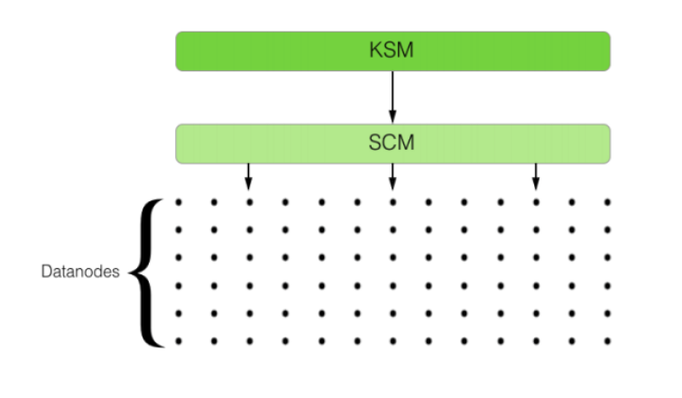
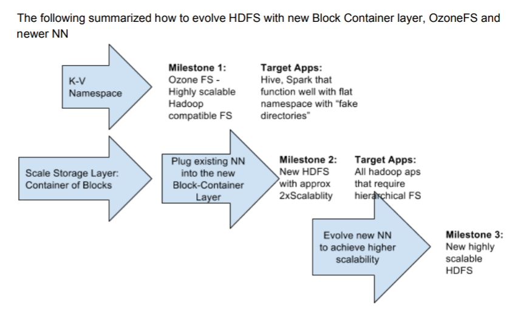

前面我们提到的HDFS，了解了HDFS的特性和架构。HDFS能够存储TB甚至PB规模的数据是有前提的，首先数据要以大文件为主，其次NameNode的内存要足够大。对HDFS有所了解的同学肯定都知道，NameNode是HDFS的存储着整个集群的元数据信息，比如所有文件和目录信息等等。而且当元数据信息较多时，NameNode的启动会变得很慢，也比较容易触发GC操作。显然当数据到了一定的量级，元数据管理会成为HDFS的一个瓶颈，其实这也是为什么说它适合存储大文件的原因。如果解决了元数据管理的问题，其实HDFS是可以支撑海量小文件的。

终于到了本篇文章的重头戏：Ozone，Ozone是Hortonworks基于HDFS实现的一个对象存储服务，旨在基于HDFS的DataNode存储，支持更大规模的数据对象存储，支持各种对象大小并且拥有HDFS的可靠性，一致性和可用性，详情请看Hadoop的Jira HDFS-7240。经过这么长时间的发展和激烈的名称讨论之后最终会命名为HDDS（Hadoop Distributed Data Store）详见Jira HDFS-10419。

那么Ozone是如何解决HDFS的现有问题的呢？

Ozone的主旨就是 Scaling HDFS（缩放HDFS）。缩放HDFS即针对HDFS当前存在的问题：NameNode元数据管理瓶颈进行处理，一方面减轻NameNode的压力，一方面抽象另外一层映射保证数据的快速读取和写入。

HDFS目前的分层如下：

1. A namespace layer（命名空间层） 在NameNode服务中实现
2. A block layer（Block块层） 主要在DataNode服务中实现，并且NameNode也会提供一个block management服务。

Ozone的设计就是针对于HDFS目前的分层去缩放相关的功能模块。

命名空间层：

1. Scaling NameSpace(缩放命名空间)
2. Scaling client/rpc load on NN（缩放NameNode支撑的请求）
3. NN startup time（缩短NameNode的启动时间）

Block块层：

1. Scaling block namespace（缩放block块的命名空间）
2. Scaling block reports（缩放block块向NN的报告请求）
3. Scaling Datanode‘s block management（缩放Block块管理层）

解决HDFS现有的问题需要同时从上面两个维度对HDFS进行优化，在其设计论文中简要描述了如何实现命名空间和Block块的缩放工作，比如参考了Ceph的分布式命名空间，或者针对于频繁操作的数据保存到内存的workingSet中，其他数据进行持久化等等。同时抽象一个大小约为2G～16G的block group层叫做container，解决Block块的缩放问题，这里我们可以脑补一下Ceph的PG。

而Ozone最终实现了两个服务来实现上面的解决方案：KSM（Key Space Manager） 和 SCM（Storage Container Manager）

KSM：负责管理的是Ozone命名空间。所有的volume，bucket、key的记录信息都保存在了KSM中。此角色类似于HDFS的NameNode。

SCM：负责管理"Container"对象，Container在逻辑上存储的是block块对象集合。DataNode是以Container的形式来提供存储能力。SCM只负责维护这些Container信息。原先的block report就会变成container report

同时Ozone也实现了一套文件系统接口，Ozone FS，它完全兼容现有的HDFS读写方式，支持Spark，Hive等程序。可以支持方便的将数据从老的HDFS转移到Ozone中。

而最终我们期待的更加完美的HDFS应该是这样的。

参考资料：
[聊聊HDFS和Ozone的融合](https://blog.csdn.net/Androidlushangderen/article/details/78450332)
[HDFS+Scalability-v2](https://issues.apache.org/jira/secure/attachment/12908432/12908432_HDFS+Scalability-v2.pdf)

欢迎关注我：叁金大数据（不稳定持续更新~~~）
