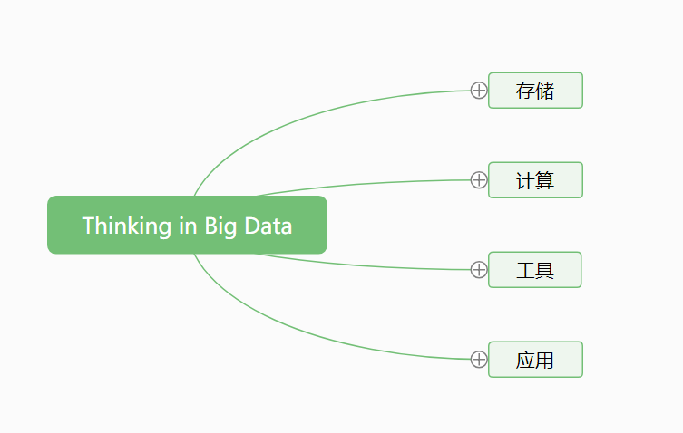
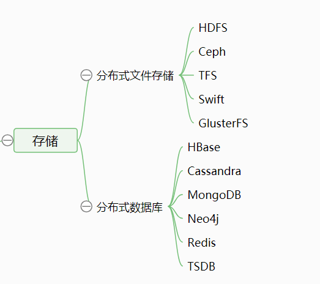
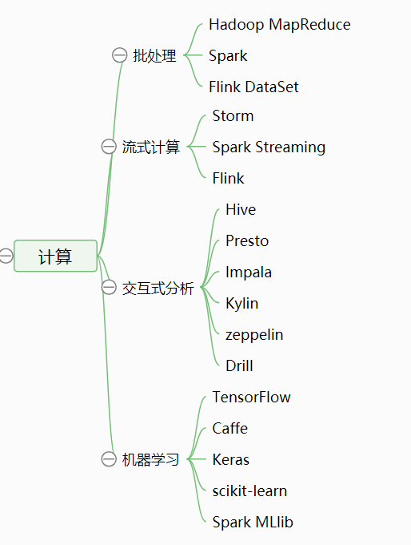
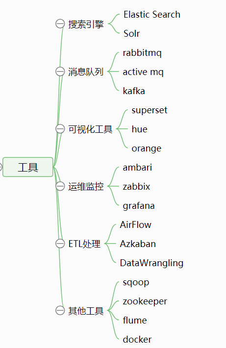

> 最近几年IT技术的发展真的是日新月异，什么云计算、大数据、机器学习、AI等等名词层出不穷。多数程序员内心其实是恐慌的，我也时常会感到危机感。每每看到“xx培训，大数据就业，钱景好”我嘴上说不要，身体还是很诚实的。

大数据已经深入我们的生活当中，今天呢我们也不聊4个V（Volume 规模大、Varity 多样性、Velocity 高速性、Value 价值大）也不谈数据挖掘，机器学习。就单纯的用大白话聊聊大数据。

从哪里开始说呢，我们先马后炮一句，可以说“大数据的出现是顺应了潮流”。为什么这么讲，我们回想一下。我们从PC时代进入了移动互联网时代，现在又重提物联网。联网的设备越来越多，人们对于网络的依赖时间越来越长，自然产生的数据就越来越大，种类也越来越多。在技术上呢我们发展出了分布式和云计算，分布式技术和云计算高速发展，进而推进了大数据发展的进程。自此大数据拥有了3个V，，天时地利。而最重要的是大量的数据里面存在着大量的价值，以致于各大互联网企业想在大数据时代去获得红利（比如Google利用人们的搜索记录挖掘数据二次利用的价值，Amazon利用用户的购买和浏览记录进行商品的针对性推荐等）。这就是最后一个V也就是人和。所以大数据技术也在飞速发展，发展成从采集、处理、存储、计算到应用这么一个完整的体系。

看到这估计有很多大佬会说“这游戏真好玩，我要充钱！”。那么我们如何入门大数据呢。相信每个人都有自己的学习方法，我自己的经验呢是首先要有大局观，然后再深入实践，最后补充基础。因为计算机技术涉及到的知识非常广，想把底子打好再学习相关技术是一件非常困难的事情，不是因为你底子打不好，而是你底子打好了技术也更新换代了。所以我们先从大局入手，对整个技术和行业有一个大的认识，再选择某一块进行具体的学习作为切入点，最终对整个行业有一个自己的认识。

上面这张图呢就是我自己根据大数据技术的特性进行分类，包含存储、计算、常用工具、应用四大部分。每个分类下有常用的技术和开源项目等。我们先上图，看看各个模块都包含哪些技术。

我这里把存储分为两类，一类是分布式文件存储，一类是分布式数据库。上面列出了常用的开源项目，比如HDFS，Hadoop的一大核心。Ceph 为OpenStack提供支持，HBase、Cassandra、MongoDB、Redis我们在工作中经常使用到。这么一看，大数据其实也不难对吧。

这张图就是对于大数据的处理和计算部分了，有Hadoop的另一大核心MapReduce，我们熟知的分布式计算引擎Spark和Flink，数据仓库Hive，数据分析引擎Presto、Impala和Drill以及机器学习相关的模块比如TensorFlow等等。这些都是我们接触大数据之后经常用到的技术和工具。

这张图里面很多工具是早于大数据技术已经发展起来的，比如Solr、ES，还有很多是通用的工具比如可视化的工具superset。他们有一个共同的特点就是，好用。可以帮助我们解决很多问题，在大数据的场景也不例外，都是需要我们熟悉和了解的。

对于应用部分呢我不是太熟悉就不多介绍了。通过上面这几张图片呢我们可以先对大数据有一个大局观。要想学好大数据技术，首先你要知道大数据如何存储吧，要知道大数据如何处理和计算吧，要知道我们在大数据应用中常用的工具吧。这些了解之后我们可以深入的去了解某个技术使用方法，优缺点，适用场景，实现原理，体系架构，优化技巧等等。当我们对于行业内常用的技术都有了一个大致的了解之后，面对客户的需求，不同行业的特性就可以提出针对性的解决方案，而不是空谈大数据的规模大、多样性、高速性和价值高了。

所以，你到现在有大局观了吗？快和我一起学习大数据吧。

欢迎关注我：叁金大数据（不稳定持续更新~~~）
