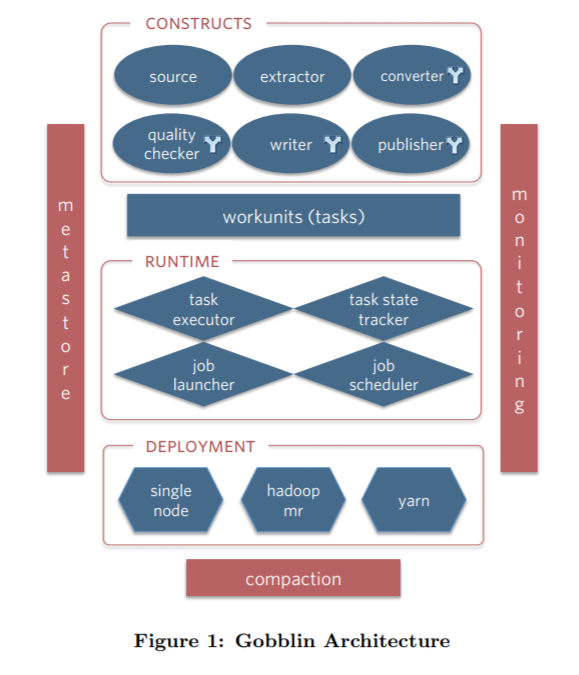
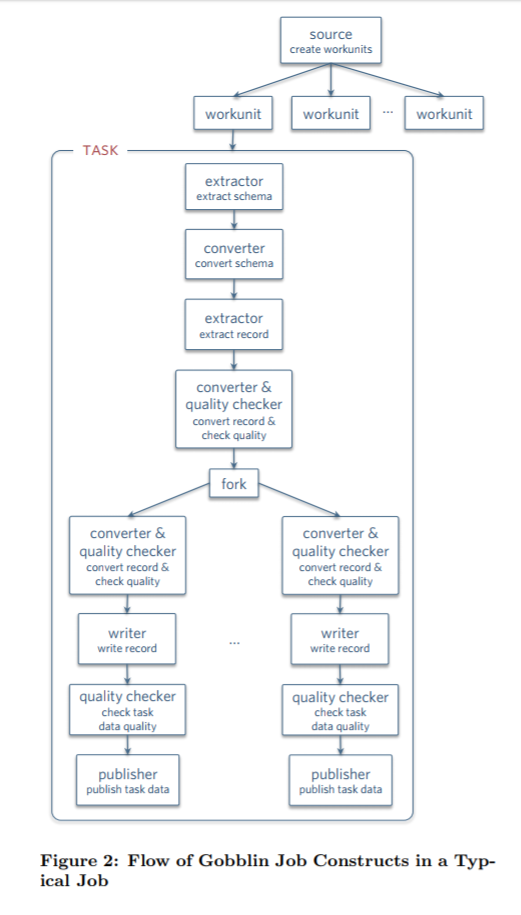

问题导读：
Gobblin的架构？
Gobblin各个组件介绍？
Gobblin采集执行流程？

前面我们介绍Gobblin是用来整合各种数据源的通用型ETL框架，在某种意义上，各种数据都可以在这里“一站式”的解决ETL整个过程，专为大数据采集而生，易于操作和监控，提供流式抽取支持。

号称整合各种数据源“一站式”解决ETL整个过程的架构到底是怎样的呢？没图说个X。

### Gobblin架构图

从Gobblin的架构图来看，Gobblin的功能真的是非常的全。底层支持三种部署方式，分别是`standalone`，`mapreduce`，`mapreduce on yarn`。可以方便快捷的与Hadoop进行集成，上层有运行时任务调度和状态管理层，可以与Oozie，Azkaban进行整合，同时也支持使用Quartz来调度（standalone模式默认使用Quartz进行调度）。对于失败的任务还拥有多种级别的重试机制，可以充分满足我们的需求。再上层呢就是由6大组件组成的执行单元了。这6大组件的设计也正是Gobblin高度可扩展的原因。

### Gobblin组件

Gobblin提供了6个不同的组件接口，因此易于扩展并进行定制化开发。分别是：

source
extractor
convertor
quality checker
writer
publisher

**Source**主要负责将源数据整合到一系列workunits中，并指出对应的extractor是什么。这有点类似于Hadoop的InputFormat。

**Extractor**则通过workunit指定数据源的信息，例如kafka，指出topic中每个partition的起始offset，用于本次抽取使用。Gobblin使用了watermark的概念，记录每次抽取的数据的起始位置信息。

**Converter**顾名思义是转换器的意思，即对抽取的数据进行一些过滤、转换操作，例如将byte arrays 或者JSON格式的数据转换为需要输出的格式。转换操作也可以将一条数据映射成0条或多条数据（类似于flatmap操作）。

**Quality Checker**即质量检测器，有2中类型的checker：record-level和task-level的策略。通过手动策略或可选的策略，将被check的数据输出到外部文件或者给出warning。

**Writer**就是把导出的数据写出，但是这里并不是直接写出到output file，而是写到一个缓冲路径（ staging directory）中。当所有的数据被写完后，才写到输出路径以便被publisher发布。Sink的路径可以包括HDFS或者kafka或者S3中，而格式可以是Avro,Parquet,或者CSV格式。同时Writer也可是根据时间戳，将输出的文件输出到按照“小时”或者“天”命名的目录中。

**Publisher**就是根据writer写出的路径，将数据输出到最终的路径。同时其提供2种提交机制：完全提交和部分提交；如果是完全提交，则需要等到task成功后才pub，如果是部分提交模式，则当task失败时，有部分在staging directory的数据已经被pub到输出路径了。

### Gobblin执行流程

Job被创建后，Runtime就根据Job的部署方式进行执行。Runtime负责job/task的定时执行，状态管理，错误处理以及失败重试，监控和报告等工作。Gobblin存在分支的概念，从数据源获取的数据由不同的分支进行处理。每个分支都可以有自己的Converter，Quality Checker，Writer和Publisher。因此各个分支可以按不同的结构发布到不同的目标地址。单个分支任务失败不会影响其他分支。
同时每一次Job的执行都会将结果持久化到文件（ SequenceFiles）中，以便下一次执行时可以读到上次执行的位置信息（例如offset），本次执行可以从上次offset开始执行本次Job。状态的存储会被定期清理，以免出现存储无限增长的情况。

### Kafka to HDFS 示例

Gobblin的官方论文上给了一个Kafka数据抽取到HDFS的示例，通过Job运行在Yarn上，Gobblin可以达到运行一个long-running，流处理的模式。分为如下几步：

Source：每个partition中起始offset都通过Source生成到workunit中；同时，从state中获取上一次抽取结尾的offset信息，以便判断本次Job执行的起始offset。

Extractor：Extractor会逐个抽取partition的数据，抽取完成一个后，会将末尾offset信息存到状态存储中。

Converter：LinkedIn内部的Kafka集群主要存储Avro格式的数据，并对此进行一些过滤和转换。

Quality Checker：LinkedIn中数据都会包含一个时间戳，以便决定放到哪个“小时”目录和“天”目录。对于没有时间戳的数据，则会根据record-level的策略将这些数据写到外部文件中。

Writer and Publisher：内部使用基于时间的writer和基于时间的publisher去写并pub数据。

### 监控

Gobblin是一个端到端的度量信息的收集系统，其度量库中包含计数、仪表盘信息、直方图等信息，收集用于监控目的。