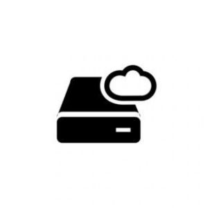
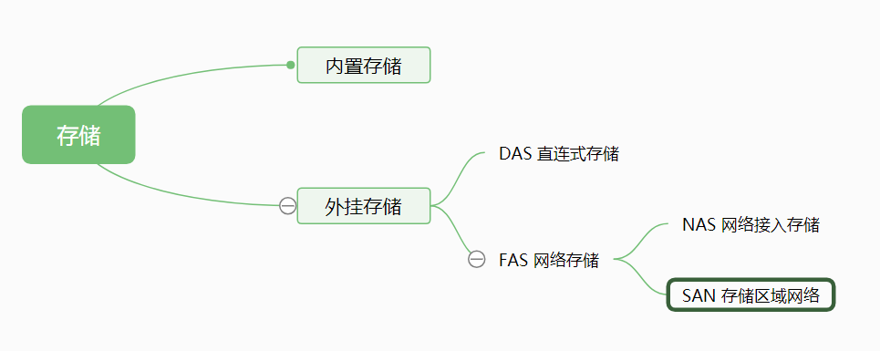

什么FAT,NTFS,NFS,DAS,SAN,NAS,OSD我一个都不认识。

不知道各位大佬对上面的名词了解多少，通过上面的一些名词其实可以大致的看到存储是怎样一步步发展的。其中FAT,NTFS和NFS都是支持特定存储协议的存储系统，DAS,SAN,NAS,OSD是一种存储模型。稍微科普一下：

FAT,NTFS大家肯定比较熟悉，这个就是单机文件系统，类似的还有EXT4等等。windows系统就是NTFS，Linux是EXT4居多。

NFS（Network File System）即网络文件系统，它允许网络中的计算机之间通过TCP/IP网络共享资源。使计算机可以像操作单机文件系统一样操作网络中的资源。

DAS（Direct-Attached Storage）直连式存储，是一种常用的存储模型。比如我们常用的移动硬盘，U盘就是直连式存储。它有非常大的弊端，不易扩容，性能低，不可靠等。

SAN（Storage Area Network）存储区域网络，它其实是建立专用于存储的区域网络，以达到存储和主机的物理分离。主要面向企业级存储，从理论上讲其易扩容可以支撑海量的数据存储，但是需要建立专用的光纤网络，成本较高。

NAS（Network Attached Storage）网络附加存储，可以简单理解为便捷的局域网存储装置，在linux系统中可以通过NFS协议挂载NAS存储。NAS相对于SAN拥有自己的操作系统，可以与各个系统更好的兼容，且更加灵活。

OSD（Object-based Storage Device）对象存储，对象存储是一种新的网络存储架构，它兼具SAN高速直接访问磁盘和NAS分布式共享的特点，将数据存储和元数据信息分离，可以更加灵活的管理数据的存储。

了解了上面那么多的名词，我们对于存储的发展大概有了一个认识了。其实存储的发展大概可以分为4个阶段，分别是单机文件系统，网络文件系统，集群文件系统和分布式文件系统。

## 单机文件系统

以FAT,NTFS为代表，DAS其实也可以算作单机文件系统，他们共同的特点就是文件存储在单台服务器上，依靠操作系统的文件系统来实现文件的存储和管理。随着数据量的增大以及对与数据安全性的需求越来越高，它们的缺点也日益显露。

1. 可扩展性：容量小，无法存储大量数据，而且不能进行扩展。
2. 性能：随着文件数量的增多，读写性能会下降
3. 可靠性：没有备份机制，一旦硬件出了故障会造成数据的丢失。

## 网络文件系统

以NAS为代表，应用实现比如我们常用的网盘。它依托于网络提供了一定的便捷性，而且支持容量扩展，解决了单机文件系统容量小的问题。但是对于性能和可靠性的问题并没解决。

## 集群文件系统

以SAN为代表，实现比如RedHat的GFS（非Google的GFS），它是通过多个节点构成一个集群，各个节点的数据是相同的，对其中一个节点的数据进行修改时，其会以广播的形式通知其他各个节点。通过这一特性解决了单机文件系统存在的各项缺点。支持多个节点的扩展，多台节点共同提供服务提高性能，多个节点都进行数据保存保障数据的可靠性。但是其同样拥有很多缺点，集群的节点不能太多，对某一数据进行修改需要修改整个集群等等

## 分布式文件系统

以HDFS,CEPH和OSD为代表，实现了支持大规模节点的集群，并且提高了存储性能和数据的可靠性。我们用过HDFS或者CEPH的都清楚，他们依托于廉价的存储设备，可以随时增删节点对整个集群进行动态的扩容，高度可扩展。可以有效的避免单点故障，具有很高的容错性，可以提高稳定可靠的服务。整个分布式系统具有较高的吞吐量，可以满足大数据时代对于数据的存储。

前面的文章初识大数据中我们提到了HDFS和CEPH，两者都是当前使用较广泛的分布式存储服务，支持万级集群规模，应用感知进行负载均衡优化性能和效率。HDFS作为Hadoop的一大核心为分布式计算提供了有力的支持，但是由于其设计对于小文件的支持并不好。CEPH实现了统一存储，同时支持文件，块和对象存储。两者都支持数据的归档压缩提高存储空间利用率，并以纠删码技术为主，复制副本技术为辅提高数据的可靠性。

是时候发明一个新名词了~~~

欢迎关注我：叁金大数据（不稳定持续更新~~~）
