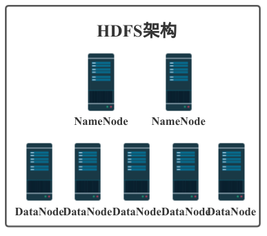
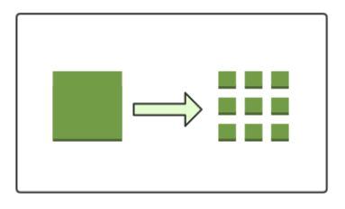
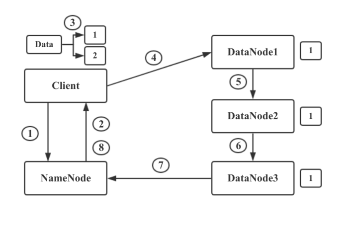
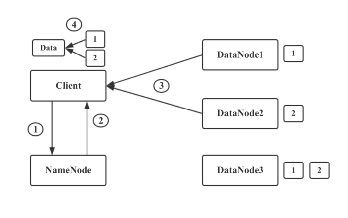

你肯定听过Hadoop，对就是那头奔跑的小象。

Hadoop作为大数据时代代表性的解决方案被大家所熟知，它主要包含两部分内容：

> HDFS分布式文件存储

> MapReduce分a布式计算框架

前面我们分析存储方案的发展的时候有提到分布式文件存储的出现是为了解决存储的三大问题：可扩展性，高吞吐量，高可靠性

那么Hadoop的核心HDFS是如何解决上面三个问题的呢？

其实设计一个系统我们要考虑到它的应用场景，然后对它的功能和特性进行设计，做出取舍。我们可能会关注这几个问题：

1. 原始存储格式 or 特殊存储格式，通过什么格式存储才能方便的管理数据，保证数据的迁移和安全。

2. 大文件 or 小文件，文件系统适合大文件还是小文件存储，如何提供I/O效率。

3. 数据高可用 or 空间利用率，通过复制副本技术提高数据可用性必然会降低空间利用率，应该如何取舍。

4. 是否有元数据服务，元数据服务是保存存储数据元数据信息的服务，读写数据都需要连接元数据服务器保证一致性。存在元数据服务势必会存在单点问题和性能瓶颈问题。

> 上面这个4个问题划重点，要考的！！！

HDFS它的设计目标就是把超大的数据集存储到多台普通计算机上，并且可以提供高可靠性和高吞吐量的服务，支持通过添加节点的方式对集群进行扩容。所以HDFS有着它自己的设计前提：

1. 对存储大文件支持很好，不适用于存储大量小文件

2. 通过流式访问数据，保证高吞吐量而不是低延时的用户响应

3. 简单一致性，使用场景应为一次写入多次读取，不支持多用户写入，不支持任意修改文件。

4. 冗余备份机制，空间换可靠性（Hadoop3中引入纠删码机制，纠删码需通过计算恢复数据，实为通过时间换空间，有兴趣的可以查看RAID的实现）

5. 移动计算优于移动数据，为支持大数据处理主张移动计算优于移动数据，提供相关接口。

遵循以上的设计前提和目标最终的成品就是我们日常应用中的HDFS了。HDFS主要由NameNode和DataNode构成，以Master/Slave模式运行。我们来详细了解一下。

## 数据块

这个就对应前面我们提出的疑问“原始存储格式 or 特殊存储格式”，在HDFS上抽象出了一个数据块的概念。可以认为是HDFS的特殊存储格式，当你存储文件的时候不是以文件为单位进行数据存储的，而是以数据块为单位进行存储。这样有什么好处呢？首先，它屏蔽了文件的概念，如果你存一个超大的文件，文件的大小大于你任何一个单个磁盘的大小，在HDFS中会把你的文件切割成多个数据块，存储到不同机器的不同磁盘中。这样就简化了存储系统的设计，而且也适用于数据的备份、迁移功能，提高了数据的容错性和可用性。

## NameNode

这个对应前面的疑问“是否有元数据服务”，在HDFS中NameNode就起着元数据管理服务的作用，它管理着整个文件系统的命名空间，维护着文件系统树详情并对其持久化。

当我们写入或者读取数据时都需要先连接NameNode，获取可操作的DataNode节点才能继续操作。所以NameNode是存在单点问题和性能问题的。Hadoop2中可以配置HA的模式，一个集群拥有两个NameNode一个处于Active状态一个处于Standby状态，其中一个失效后另一个可以自动切换成Active，进而解决了一部分单点问题。（在Hadoop3中支持配置多个NameNode，进一步解决NameNode的单点问题）。NameNode将元数据信息保存在内存中，内存就是NameNode的性能瓶颈，如果集群中小文件过多会产生大量元数据信息占用NameNode的内存。所以HDFS对大文件的支持更好。NameNode会占用较多的内存和I/O资源，所以运行NameNode的节点不会启动DataNode或者执行MapReduce任务。

## DataNode

DataNode就是HDFS的工作节点了，它负责存储数据，为客户端提供数据块的读写服务。在启动时会将它存储的数据块的列表发送给NameNode，根据NameNode的要求对数据块进行创建、删除和备份，还会通过心跳定期向NameNode更新存储数据块信息。

HDFS通过备份副本的方式实现可靠性，Hadoop2缺省的数据块大小为128M，复制因子为，默认的备份副本的分布位置与机架和节点有关。当DataNode丢失连接后，NameNode会把失败节点的数据（从其他备份副本节点）复制到另外一个健康的DataNode节点，保证集群里面的数据库始终维持指定的副本数量。

## 写流程

1. 首先，HDFS Client和NameNode建立连接，告诉NameNode要存储一个文件。NameNode维护着DataNode的列表，知道哪些DataNode上面还有空间可以进行存储。
2. NameNode通过查看存储的元数据信息，发现DataNode1,2,3上可以进行存储。于是他将此信息返回给HDFS Client。
3. HDFS Client接受到NameNode的返回的DataNode列表后，Client会与距离最近DataNode1建立连接，让其准备好接收数据。然后将文件进行分块，将数据块1和NameNode返回的DataNode列表信息一起发送给DataNode1.
4. DataNode1通过列表信息得知要发送给DataNode2.所以DataNode1将数据与列表信息发送给DataNode2.DataNode2又发送给DataNode3，此时数据块1已经存储完成并备份了三份。
5. 当DataNode1,2,3都接收并存储数据块1后，会向NameNode发送信息，告知已经接收到了数据块1.并把数据块1相关信息发送给NameNode，NameNode更新元数据信息并 与Client通信告知数据块1已经存储完毕。然后Client开始进行数据块2的存储。

这里需要注意的是一个大型的HDFS文件系统一般都是需要跨很多机架的，不同机架之间的数据传输需要经过网关，并且，同一个机架中机器之间的带宽要大于不同机架机器之间的带宽。如果把所有的副本都放在不同的机架中，这样既可以防止机架失败导致数据块不可用，又可以在读数据时利用到多个机架的带宽，并且也可以很容易的实现负载均衡。如果副本数量是3的情况下，HDFS默认把第一个副本放到机架的一个节点上，另一个副本放到同一个机架的另一个节点上，把最后一个节点放到不同的机架上。这种策略减少了跨机架副本的个数提高了写的性能，也能够允许一个机架失败的情况，算是一个很好的权衡。

## 读流程

1. HDFS Client与NameNode建立链接，告诉NameNode要读取文件xxx。
2. NameNode通过查询自己的元数据信息，得到文件xxx的数据块映射信息及存储数据块的DataNode列表。然后将这些信息发送给Client。
3. Client得到这些信息之后，寻找最近可用的DataNode1.取回数据块1.从DataNode2取回数据块2. 自此成功读取文件xxx
4. 如果DataNode2出现问题挂掉了，则从DataNode3进行数据块读取。

文件读取时，NameNode会选择最近的DataNode提供给客户端。

划重点划重点，要考的！！！

欢迎关注我：叁金大数据（不稳定持续更新~~~）
