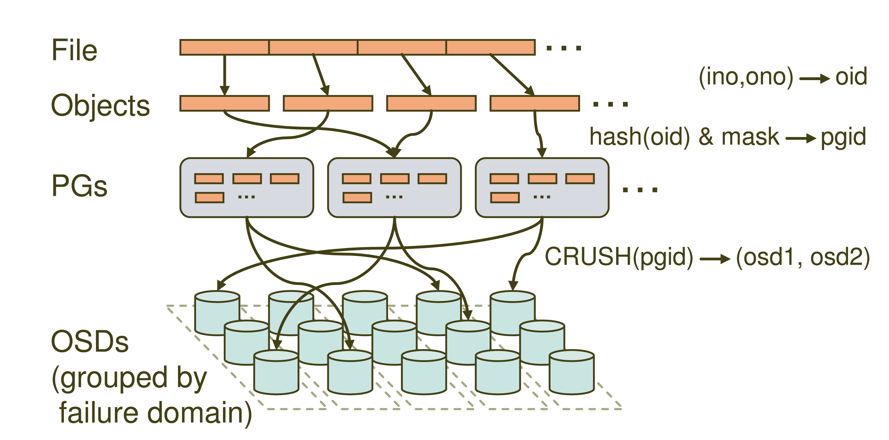

前面我们提到了Ceph是一个支持统一存储架构的分布式存储服务。简单介绍了Ceph的基本概念和基础架构包含的组件，其中最重要的就是底层的RADOS和它的两类守护进程OSD and Monitor。上篇文章我们还挖了一个坑，我们提到了CRUSH。

是的，我们这篇教程就是一篇不完整的Ceph教材，因为我们讲CRUSH并不涉及其算法和实现原理，我们讲的是Ceph整体的寻址流程，并借此深入理解一下Ceph中数据的操作流程。

这张就是Ceph的寻址流程示意图了，大家可以看到里面主要分四层，File->Objects->PGs->OSDs。很多同学就要问了，这什么Objects，PGs是什么新名词啊，我们先来看一下哈。

**File**:就是我们想要存储和访问的文件了，这个是面向我们用户的，是我们直观操作的对象。

**Object**：这个object就是Ceph底层RADOS所看到的对象，也就是在Ceph中存储的基本单位了。object的大小由RADOS限定（通常为2m或者4m）。就跟HDFS抽象一个数据块一样，这里也是为了方便底层存储的组织管理。当File过大时，需要将File切分成大小统一的objects进行存储。

**PG (Placement Group)**:PG是一个逻辑的概念，它的用途是对object的存储进行组织和位置的映射，通过它可以更好的分配数据和定位数据。

**OSD (Object Storage Device)**:这个前面我们也介绍过了，它就是真正负责数据存取的服务。

PG和object是一对多的关系，一个PG里面组织若干个object，但是一个object只能被映射到一个PG中。

PG和OSD是多对多的关系，一个PG会映射到多个OSD上（大于等于2,此处即为副本机制），每个OSD也会承载大量的PG。

了解了上面一些基本的概念之后，就要到我们的寻址流程讲解了，通过寻址流程图我们可以看到，Ceph中的寻址需要经历三次映射，分别是File->Object,Object->PG,PG->OSD。我们重点提到的CRUSH就是在第三步映射PG->OSD出现的。我们依次看一下。

## File->Object

这一步非常简单，就是将file切分成多个object。每个object都有唯一的id即oid。这个oid是怎样产生的呢，就是根据文件名称得到的。

图中的ino为文件唯一id（比如filename+timestamp），ono则为切分后某个object的序号(比如0,1,2,3,4,5等)，根据该文件的大小我们就会得到一系列的oid。

注：将文件切分为大小一致的object可以被RADOS高效管理，而且可以将对单一file的处理变成并行化处理提高处理效率。

## Object -> PG

这里需要做的工作就是将每个object映射到一个PG中去，实现方式也很简单就是对oid进行hash然后进行按位与计算得到某一个PG的id。图中的mask为PG的数量减1。这里我们认为得到的pgid是随机的，这与PG的数量和文件的数量有关系。在足够量级的程度上数据是均匀分布的。

## PG -> OSD

最后一次映射就是将object所在的PG映射到实际的存储位置OSD上。这里应用的就是CRUSH算法了，通过CRUSH算法可以通过pgid得到多个osd（跟配置有关）。

因为我们不会过多的讨论CRUSH是如何实现的，我们可以换个思考的角度认识一下CRUSH都做了哪些工作。假如我们不用CRUSH用HASH是否可以？我们也套用上面的公式hash（pgid） & mask = osdid是否可以实现呢？

假如我们这里也用hash算法生成osdid，如果我们的osd的数量发生了改变，那么mask的值就会改变，我们最终得到的osdid的值就会改变。这就意味着我当前这个PG保存的位置发生了改变，该PG下的数据都需要迁移到另外一个OSD上去了，这肯定是行不通的。而Ceph是支持多副本备份机制的，PG是应该映射到多个OSD上去，而通过HASH的方式只能得到一个。所以这里就需要CRUSH了，CRUSH可以根据集群的OSD状态和存储策略配置动态得到osdid，从而自动化的实现高可靠性和数据均匀分布。

关于CRUSH的详细实现还需参考Sage Weil的论文。

现在我们已经对三次映射有了一个简单的了解，大家可以看到我们整个过程中我们只知道文件的名称和文件大小等信息，并没有去查询文件所在位置信息等等，都是通过计算算出来的。上篇文章中我们提到的Monitors（提供元数据服务存储）实际上只是维护着整个集群中一些服务的状态信息也叫做ClusterMap。至于数据到底是在哪个osd是通过CRUSH算法计算出来的。所以这里的元数据服务跟HDFS的NameNode就又不一样了。NameNode里面保持的就是每个block所在的具体位置。那么Ceph是怎样做到的呢，其实就是因为逻辑层PG和CRUSH算法。读懂了Ceph的寻址流程那么对于Ceph的数据读写流程自然就不陌生了。

是时候看看Sage Weil的论文了

参考：
[Ceph官方文档](http://docs.ceph.org.cn/architecture/)
[ceph存储数据的详细流程（CRUSH）](https://blog.csdn.net/cloudxli/article/details/79518620)

欢迎关注我：叁金大数据（不稳定持续更新~~~）
